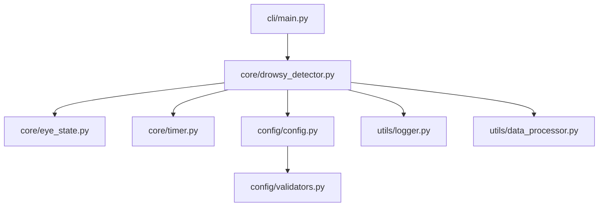

# 連続閉眼検知アルゴリズム Python実装詳細設計書 (SD_drowsy_detection_python)

## 1. 概要・目的

### 1.1 設計書名
- 連続閉眼検知アルゴリズム Python実装詳細設計書
- 略称: SD_drowsy_detection_python
- バージョン: v0.1.1
- 作成日: 2025-08-07

### 1.2 目的・背景
- AS_drowsy_detection.md の仕様に基づき、Pythonモジュールとして実装するための詳細設計
- 保守性・拡張性・テスト容易性を重視した設計
- 組込みシステムでの実用性を考慮した軽量実装

### 1.3 設計方針
- **モジュール化**: 機能ごとに独立したクラス・モジュールに分割
- **型安全性**: Pydantic による入力検証と型チェック
- **エラーハンドリング**: 堅牢なエラー処理とログ出力
- **テスト容易性**: 単体テスト・統合テストの実装を考慮

---

## 2. システム構成

### 2.1 全体アーキテクチャ
```
drowsy_detection/
├── source/
│   ├── __init__.py
│   ├── config/
│   │   ├── __init__.py
│   │   ├── config.py          # 設定管理
│   │   └── validators.py      # 入力検証
│   ├── core/
│   │   ├── __init__.py
│   │   ├── drowsy_detector.py # メインアルゴリズム
│   │   ├── eye_state.py       # 目の状態管理
│   │   └── timer.py           # タイマー管理
│   ├── utils/
│   │   ├── __init__.py
│   │   ├── logger.py          # ログ機能
│   │   └── data_processor.py  # データ前処理
│   └── cli/
│       ├── __init__.py
│       └── main.py            # CLI エントリポイント
├── tests/
│   ├── __init__.py
│   ├── test_config.py
│   ├── test_drowsy_detector.py
│   ├── test_eye_state.py
│   └── test_integration.py
├── examples/
│   ├── basic_usage.py
│   └── video_processing.py
└── docs/
    ├── api_reference.md
    └── usage_examples.md
```

### 2.2 モジュール依存関係


---

## 3. 詳細設計

### 3.1 設定管理 (config/config.py)

#### 3.1.1 Config クラス
```python
from pydantic import BaseModel, Field, validator
from typing import Optional
import logging

class Config(BaseModel):
    """連続閉眼検知アルゴリズムの設定クラス"""
    
    # 閾値パラメータ
    left_eye_close_threshold: float = Field(
        default=0.105,
        ge=0.0,
        le=1.0,
        description="左目の開眼度がこの値以下で閉眼と判定"
    )
    right_eye_close_threshold: float = Field(
        default=0.105,
        ge=0.0,
        le=1.0,
        description="右目の開眼度がこの値以下で閉眼と判定"
    )
    continuous_close_time: float = Field(
        default=1.00,
        ge=0.1,
        le=10.0,
        description="連続閉眼とみなす時間閾値 [s]"
    )
    face_conf_threshold: float = Field(
        default=0.75,
        ge=0.0,
        le=1.0,
        description="顔検出が有効とみなす信頼度"
    )
    
    # ログ設定
    log_level: str = Field(
        default="INFO",
        description="ログレベル"
    )
    enable_debug_log: bool = Field(
        default=False,
        description="デバッグログ有効化"
    )
    
    # 前処理設定
    enable_ema_filter: bool = Field(
        default=True,
        description="指数移動平均フィルタ有効化"
    )
    ema_alpha: float = Field(
        default=0.3,
        ge=0.0,
        le=1.0,
        description="EMA フィルタ係数"
    )
    
    @validator('log_level')
    def validate_log_level(cls, v):
        valid_levels = ['DEBUG', 'INFO', 'WARNING', 'ERROR', 'CRITICAL']
        if v.upper() not in valid_levels:
            raise ValueError(f'log_level must be one of {valid_levels}')
        return v.upper()
    
    class Config:
        validate_assignment = True
```

#### 3.1.2 設定検証機能
```python
class ConfigValidator:
    """設定値の妥当性検証クラス"""
    
    @staticmethod
    def validate_thresholds(config: Config) -> bool:
        """閾値の妥当性を検証"""
        if config.left_eye_close_threshold > 1.0:
            raise ValueError("left_eye_close_threshold must be <= 1.0")
        if config.right_eye_close_threshold > 1.0:
            raise ValueError("right_eye_close_threshold must be <= 1.0")
        return True
    
    @staticmethod
    def validate_time_constraints(config: Config) -> bool:
        """時間制約の妥当性を検証"""
        if config.continuous_close_time < 0.1:
            raise ValueError("continuous_close_time must be >= 0.1")
        return True
```

### 3.2 データモデル (config/validators.py)

#### 3.2.1 入力データモデル
```python
from pydantic import BaseModel, Field, validator
from typing import Optional
import numpy as np

class InputData(BaseModel):
    """アルゴリズム入力データモデル"""
    
    frame_num: int = Field(
        description="フレーム番号（単調増加）"
    )
    left_eye_open: float = Field(
        ge=0.0,
        le=1.0,
        description="左目の開眼度 (0.0〜1.0)"
    )
    right_eye_open: float = Field(
        ge=0.0,
        le=1.0,
        description="右目の開眼度 (0.0〜1.0)"
    )
    face_confidence: float = Field(
        ge=0.0,
        le=1.0,
        description="顔検出信頼度 (0.0〜1.0)"
    )
    
    @validator('frame_num')
    def validate_frame_num(cls, v):
        if v < 0:
            raise ValueError("frame_num must be non-negative")
        return v
    
    @validator('left_eye_open', 'right_eye_open', 'face_confidence')
    def validate_float_values(cls, v):
        if np.isnan(v):
            raise ValueError("Input values cannot be NaN")
        return v

class OutputData(BaseModel):
    """アルゴリズム出力データモデル"""
    
    is_drowsy: int = Field(
        description="連続閉眼状態判定結果"
    )
    frame_num: int = Field(
        description="対応するフレーム番号"
    )
    left_eye_closed: bool = Field(
        description="左目閉眼フラグ"
    )
    right_eye_closed: bool = Field(
        description="右目閉眼フラグ"
    )
    continuous_time: float = Field(
        description="現在の連続閉眼時間 [s]"
    )
    error_code: Optional[str] = Field(
        default=None,
        description="エラーコード（エラー時のみ）"
    )
    
    @validator('is_drowsy')
    def validate_is_drowsy(cls, v):
        valid_values = [-1, 0, 1]
        if v not in valid_values:
            raise ValueError(f"is_drowsy must be one of {valid_values}")
        return v
```

### 3.3 タイマー管理 (core/timer.py)

#### 3.3.1 ContinuousTimer クラス
```python
import time
from typing import Optional
from dataclasses import dataclass

@dataclass
class TimerState:
    """タイマー状態データクラス"""
    is_active: bool = False
    start_time: Optional[float] = None
    current_duration: float = 0.0
    last_update_time: Optional[float] = None

class ContinuousTimer:
    """連続時間計測タイマークラス"""
    
    def __init__(self, threshold: float):
        """
        Args:
            threshold: 閾値時間 [s]
        """
        self.threshold = threshold
        self.state = TimerState()
    
    def start(self) -> None:
        """タイマー開始"""
        current_time = time.time()
        self.state.is_active = True
        self.state.start_time = current_time
        self.state.last_update_time = current_time
        self.state.current_duration = 0.0
    
    def stop(self) -> None:
        """タイマー停止"""
        self.state.is_active = False
        self.state.start_time = None
        self.state.last_update_time = None
        self.state.current_duration = 0.0
    
    def update(self, dt: float) -> float:
        """
        タイマー更新
        
        Args:
            dt: 経過時間 [s]
            
        Returns:
            現在の継続時間 [s]
        """
        if not self.state.is_active:
            return 0.0
        
        self.state.current_duration += dt
        return self.state.current_duration
    
    def is_threshold_exceeded(self) -> bool:
        """閾値を超えているかチェック"""
        return self.state.current_duration >= self.threshold
    
    def get_current_duration(self) -> float:
        """現在の継続時間を取得"""
        return self.state.current_duration
    
    def reset(self) -> None:
        """タイマーリセット"""
        self.stop()
```

### 3.4 目の状態管理 (core/eye_state.py)

#### 3.4.1 EyeState クラス
```python
from dataclasses import dataclass
from typing import Tuple
import numpy as np

@dataclass
class EyeState:
    """目の状態データクラス"""
    is_closed: bool
    open_ratio: float
    filtered_open_ratio: float

class EyeStateManager:
    """目の状態管理クラス"""
    
    def __init__(self, close_threshold: float, enable_filter: bool = True, alpha: float = 0.3):
        """
        Args:
            close_threshold: 閉眼判定閾値
            enable_filter: フィルタ有効化フラグ
            alpha: EMA フィルタ係数
        """
        self.close_threshold = close_threshold
        self.enable_filter = enable_filter
        self.alpha = alpha
        self.filtered_value = None
        self.is_initialized = False
    
    def update(self, open_ratio: float) -> EyeState:
        """
        目の状態を更新
        
        Args:
            open_ratio: 開眼度 (0.0〜1.0)
            
        Returns:
            更新された目の状態
        """
        # 入力値の正規化
        normalized_ratio = np.clip(open_ratio, 0.0, 1.0)
        
        # フィルタ適用
        if self.enable_filter:
            filtered_ratio = self._apply_ema_filter(normalized_ratio)
        else:
            filtered_ratio = normalized_ratio
        
        # 閉眼判定
        is_closed = filtered_ratio <= self.close_threshold
        
        return EyeState(
            is_closed=is_closed,
            open_ratio=normalized_ratio,
            filtered_open_ratio=filtered_ratio
        )
    
    def _apply_ema_filter(self, value: float) -> float:
        """指数移動平均フィルタを適用"""
        if not self.is_initialized:
            self.filtered_value = value
            self.is_initialized = True
        else:
            self.filtered_value = self.alpha * value + (1 - self.alpha) * self.filtered_value
        
        return self.filtered_value
    
    def reset(self) -> None:
        """状態リセット"""
        self.filtered_value = None
        self.is_initialized = False
```

### 3.5 メインアルゴリズム (core/drowsy_detector.py)

#### 3.5.1 DrowsyDetector クラス
```python
from typing import Optional
from config.config import Config
from config.validators import InputData, OutputData
from core.eye_state import EyeStateManager
from core.timer import ContinuousTimer
from utils.logger import Logger
from utils.data_processor import DataProcessor

class DrowsyDetector:
    """連続閉眼検知アルゴリズムメインクラス"""
    
    def __init__(self, config: Config):
        """
        Args:
            config: 設定オブジェクト
        """
        self.config = config
        self.logger = Logger(config.log_level, config.enable_debug_log)
        
        # 目の状態管理
        self.left_eye_manager = EyeStateManager(
            close_threshold=config.left_eye_close_threshold,
            enable_filter=config.enable_ema_filter,
            alpha=config.ema_alpha
        )
        self.right_eye_manager = EyeStateManager(
            close_threshold=config.right_eye_close_threshold,
            enable_filter=config.enable_ema_filter,
            alpha=config.ema_alpha
        )
        
        # タイマー管理
        self.timer = ContinuousTimer(config.continuous_close_time)
        
        # データ前処理
        self.data_processor = DataProcessor()
        
        # 状態管理
        self.last_frame_num = -1
        self.last_valid_result = None
        
        self.logger.info("DrowsyDetector initialized")
    
    def update(self, input_data: InputData) -> OutputData:
        """
        アルゴリズム更新処理
        
        Args:
            input_data: 入力データ
            
        Returns:
            判定結果
        """
        try:
            # フレーム番号チェック
            if input_data.frame_num <= self.last_frame_num:
                self.logger.warning(f"Invalid frame number: {input_data.frame_num}")
                return self._create_error_output(input_data.frame_num, "INVALID_FRAME_NUM")
            
            # 顔検出信頼度チェック
            if input_data.face_confidence < self.config.face_conf_threshold:
                self.logger.debug(f"Low face confidence: {input_data.face_confidence}")
                self._reset_state()
                return self._create_error_output(input_data.frame_num, "LOW_FACE_CONFIDENCE")
            
            # データ前処理
            processed_data = self.data_processor.preprocess(input_data)
            
            # 目の状態更新
            left_eye_state = self.left_eye_manager.update(processed_data.left_eye_open)
            right_eye_state = self.right_eye_manager.update(processed_data.right_eye_open)
            
            # 連続閉眼判定
            result = self._evaluate_drowsy_state(
                input_data.frame_num,
                left_eye_state,
                right_eye_state
            )
            
            # 状態更新
            self.last_frame_num = input_data.frame_num
            self.last_valid_result = result
            
            self.logger.debug(f"Frame {input_data.frame_num}: is_drowsy={result.is_drowsy}")
            
            return result
            
        except Exception as e:
            self.logger.error(f"Error in update: {str(e)}")
            return self._create_error_output(input_data.frame_num, "INTERNAL_ERROR")
    
    def _evaluate_drowsy_state(
        self,
        frame_num: int,
        left_eye_state: EyeState,
        right_eye_state: EyeState
    ) -> OutputData:
        """眠気状態を評価"""
        
        # 両目が閉眼状態かチェック
        both_eyes_closed = left_eye_state.is_closed and right_eye_state.is_closed
        
        if both_eyes_closed:
            # タイマー開始または更新
            if not self.timer.state.is_active:
                self.timer.start()
            
            # フレーム間隔を仮定（30fps）
            dt = 1.0 / 30.0
            self.timer.update(dt)
            
            # 閾値チェック
            if self.timer.is_threshold_exceeded():
                is_drowsy = 1
            else:
                is_drowsy = 0
        else:
            # タイマーリセット
            self.timer.stop()
            is_drowsy = 0
        
        return OutputData(
            is_drowsy=is_drowsy,
            frame_num=frame_num,
            left_eye_closed=left_eye_state.is_closed,
            right_eye_closed=right_eye_state.is_closed,
            continuous_time=self.timer.get_current_duration(),
            error_code=None
        )
    
    def _reset_state(self) -> None:
        """状態リセット"""
        self.timer.stop()
        self.left_eye_manager.reset()
        self.right_eye_manager.reset()
    
    def _create_error_output(self, frame_num: int, error_code: str) -> OutputData:
        """エラー出力を作成"""
        return OutputData(
            is_drowsy=-1,
            frame_num=frame_num,
            left_eye_closed=False,
            right_eye_closed=False,
            continuous_time=0.0,
            error_code=error_code
        )
    
    def reset(self) -> None:
        """完全リセット"""
        self._reset_state()
        self.last_frame_num = -1
        self.last_valid_result = None
        self.logger.info("DrowsyDetector reset")
```

### 3.6 ログ機能 (utils/logger.py)

#### 3.6.1 Logger クラス
```python
import logging
import sys
from datetime import datetime
from typing import Optional

class Logger:
    """ログ管理クラス"""
    
    def __init__(self, level: str = "INFO", enable_debug: bool = False):
        """
        Args:
            level: ログレベル
            enable_debug: デバッグログ有効化
        """
        self.logger = logging.getLogger("drowsy_detection")
        self.logger.setLevel(getattr(logging, level))
        
        # ハンドラー設定
        if not self.logger.handlers:
            handler = logging.StreamHandler(sys.stdout)
            formatter = logging.Formatter(
                '%(asctime)s - %(name)s - %(levelname)s - %(message)s'
            )
            handler.setFormatter(formatter)
            self.logger.addHandler(handler)
        
        # デバッグログ設定
        if enable_debug:
            debug_handler = logging.FileHandler("drowsy_detection_debug.log")
            debug_handler.setLevel(logging.DEBUG)
            debug_formatter = logging.Formatter(
                '%(asctime)s - %(name)s - %(levelname)s - %(funcName)s:%(lineno)d - %(message)s'
            )
            debug_handler.setFormatter(debug_formatter)
            self.logger.addHandler(debug_handler)
    
    def info(self, message: str) -> None:
        """情報ログ"""
        self.logger.info(message)
    
    def warning(self, message: str) -> None:
        """警告ログ"""
        self.logger.warning(message)
    
    def error(self, message: str) -> None:
        """エラーログ"""
        self.logger.error(message)
    
    def debug(self, message: str) -> None:
        """デバッグログ"""
        self.logger.debug(message)
```

### 3.7 データ前処理 (utils/data_processor.py)

#### 3.7.1 DataProcessor クラス
```python
import numpy as np
from config.validators import InputData
from dataclasses import dataclass

@dataclass
class ProcessedData:
    """前処理済みデータクラス"""
    left_eye_open: float
    right_eye_open: float
    face_confidence: float

class DataProcessor:
    """データ前処理クラス"""
    
    def __init__(self):
        self.last_valid_data = None
    
    def preprocess(self, input_data: InputData) -> ProcessedData:
        """
        入力データの前処理
        
        Args:
            input_data: 生入力データ
            
        Returns:
            前処理済みデータ
        """
        # NaN チェックと補完
        left_eye = self._handle_nan_value(input_data.left_eye_open, "left_eye_open")
        right_eye = self._handle_nan_value(input_data.right_eye_open, "right_eye_open")
        face_conf = self._handle_nan_value(input_data.face_confidence, "face_confidence")
        
        # 範囲制限
        left_eye = np.clip(left_eye, 0.0, 1.0)
        right_eye = np.clip(right_eye, 0.0, 1.0)
        face_conf = np.clip(face_conf, 0.0, 1.0)
        
        # 有効データとして保存
        self.last_valid_data = ProcessedData(
            left_eye_open=left_eye,
            right_eye_open=right_eye,
            face_confidence=face_conf
        )
        
        return self.last_valid_data
    
    def _handle_nan_value(self, value: float, field_name: str) -> float:
        """NaN値の処理"""
        if np.isnan(value):
            if self.last_valid_data is not None:
                # 直前の有効値で補完
                if field_name == "left_eye_open":
                    return self.last_valid_data.left_eye_open
                elif field_name == "right_eye_open":
                    return self.last_valid_data.right_eye_open
                elif field_name == "face_confidence":
                    return self.last_valid_data.face_confidence
            
            # デフォルト値
            return 0.0
        
        return value
    
    def reset(self) -> None:
        """状態リセット"""
        self.last_valid_data = None
```

---

## 4. テスト設計

### 4.1 単体テスト (tests/test_drowsy_detector.py)

#### 4.1.1 テストケース設計
```python
import pytest
import numpy as np
from config.config import Config
from config.validators import InputData
from core.drowsy_detector import DrowsyDetector

class TestDrowsyDetector:
    """DrowsyDetector 単体テスト"""
    
    @pytest.fixture
    def config(self):
        """テスト用設定"""
        return Config(
            left_eye_close_threshold=0.105,
            right_eye_close_threshold=0.105,
            continuous_close_time=1.0,
            face_conf_threshold=0.75
        )
    
    @pytest.fixture
    def detector(self, config):
        """テスト用検出器"""
        return DrowsyDetector(config)
    
    def test_normal_operation(self, detector):
        """正常動作テスト"""
        # 開眼状態
        input_data = InputData(
            frame_num=1,
            left_eye_open=0.8,
            right_eye_open=0.9,
            face_confidence=0.95
        )
        result = detector.update(input_data)
        assert result.is_drowsy == 0
        assert not result.left_eye_closed
        assert not result.right_eye_closed
    
    def test_continuous_eye_closure(self, detector):
        """連続閉眼テスト"""
        # 閉眼状態を継続
        for i in range(35):  # 30fps * 1.2秒
            input_data = InputData(
                frame_num=i+1,
                left_eye_open=0.1,
                right_eye_open=0.1,
                face_confidence=0.95
            )
            result = detector.update(input_data)
        
        assert result.is_drowsy == 1
    
    def test_low_face_confidence(self, detector):
        """低信頼度テスト"""
        input_data = InputData(
            frame_num=1,
            left_eye_open=0.1,
            right_eye_open=0.1,
            face_confidence=0.5  # 閾値以下
        )
        result = detector.update(input_data)
        assert result.is_drowsy == -1
        assert result.error_code == "LOW_FACE_CONFIDENCE"
    
    def test_nan_input_handling(self, detector):
        """NaN入力処理テスト"""
        input_data = InputData(
            frame_num=1,
            left_eye_open=np.nan,
            right_eye_open=0.5,
            face_confidence=0.95
        )
        result = detector.update(input_data)
        assert result.is_drowsy == 0  # 正常に処理される
```

### 4.2 統合テスト (tests/test_integration.py)

#### 4.2.1 統合テストケース
```python
import pytest
import numpy as np
from config.config import Config
from core.drowsy_detector import DrowsyDetector

class TestIntegration:
    """統合テスト"""
    
    def test_long_duration_simulation(self):
        """長時間シミュレーションテスト"""
        config = Config(
            continuous_close_time=0.5,  # 短時間でテスト
            enable_debug_log=True
        )
        detector = DrowsyDetector(config)
        
        drowsy_count = 0
        total_frames = 1800  # 30fps * 60秒
        
        for i in range(total_frames):
            # ランダムな開眼度（時々閉眼）
            if i % 100 < 30:  # 30%の確率で閉眼
                left_eye = np.random.uniform(0.0, 0.2)
                right_eye = np.random.uniform(0.0, 0.2)
            else:
                left_eye = np.random.uniform(0.5, 1.0)
                right_eye = np.random.uniform(0.5, 1.0)
            
            input_data = InputData(
                frame_num=i+1,
                left_eye_open=left_eye,
                right_eye_open=right_eye,
                face_confidence=0.95
            )
            
            result = detector.update(input_data)
            if result.is_drowsy == 1:
                drowsy_count += 1
        
        # 誤検知率チェック（5%以下）
        false_positive_rate = drowsy_count / total_frames
        assert false_positive_rate < 0.05
```

---

## 5. パフォーマンス設計

### 5.1 性能要件
- **処理速度**: 30fps 以上（33ms以下）
- **メモリ使用量**: 100MB以下
- **CPU使用率**: Raspberry Pi 4 で20%以下

### 5.2 最適化戦略
- **NumPy 活用**: ベクトル化演算で高速化
- **メモリ効率**: 必要最小限のデータ保持
- **ログ最適化**: デバッグログは条件付き出力

### 5.3 プロファイリング
```python
import time
import cProfile
import pstats

def profile_detector():
    """性能プロファイリング"""
    config = Config()
    detector = DrowsyDetector(config)
    
    profiler = cProfile.Profile()
    profiler.enable()
    
    # 1000フレーム処理
    for i in range(1000):
        input_data = InputData(
            frame_num=i+1,
            left_eye_open=0.5,
            right_eye_open=0.5,
            face_confidence=0.95
        )
        detector.update(input_data)
    
    profiler.disable()
    stats = pstats.Stats(profiler)
    stats.sort_stats('cumulative')
    stats.print_stats(10)
```

---

## 6. エラーハンドリング

### 6.1 エラーコード定義
```python
from enum import Enum

class ErrorCode(Enum):
    """エラーコード定義"""
    INVALID_FRAME_NUM = "INVALID_FRAME_NUM"
    LOW_FACE_CONFIDENCE = "LOW_FACE_CONFIDENCE"
    INVALID_INPUT_DATA = "INVALID_INPUT_DATA"
    INTERNAL_ERROR = "INTERNAL_ERROR"
    TIMER_ERROR = "TIMER_ERROR"
```

### 6.2 エラー処理戦略
- **入力検証**: Pydantic による型・範囲チェック
- **例外処理**: try-catch による堅牢な処理
- **フォールバック**: 直前の有効値による補完
- **ログ出力**: 詳細なエラー情報の記録

---

## 7. 使用例

### 7.1 基本的な使用例 (examples/basic_usage.py)
```python
from config.config import Config
from config.validators import InputData
from core.drowsy_detector import DrowsyDetector

def main():
    # 設定
            config = Config(
            left_eye_close_threshold=0.105,
            right_eye_close_threshold=0.105,
            continuous_close_time=1.0,
            face_conf_threshold=0.75
        )
    
    # 検出器初期化
    detector = DrowsyDetector(config)
    
    # シミュレーション
    for i in range(100):
        input_data = InputData(
            frame_num=i+1,
            left_eye_open=0.1,  # 閉眼
            right_eye_open=0.1,  # 閉眼
            face_confidence=0.95
        )
        
        result = detector.update(input_data)
        
        if result.is_drowsy == 1:
            print(f"警告: 眠気検知 (フレーム {result.frame_num})")
        elif result.is_drowsy == -1:
            print(f"エラー: {result.error_code}")

if __name__ == "__main__":
    main()
```

### 7.2 CLI エントリポイント (cli/main.py)
```python
import argparse
import json
from config.config import Config
from core.drowsy_detector import DrowsyDetector

def main():
    parser = argparse.ArgumentParser(description="連続閉眼検知アルゴリズム")
    parser.add_argument("--config", type=str, help="設定ファイルパス")
    parser.add_argument("--input", type=str, help="入力JSONファイル")
    parser.add_argument("--output", type=str, help="出力JSONファイル")
    
    args = parser.parse_args()
    
    # 設定読み込み
    if args.config:
        with open(args.config, 'r') as f:
            config_data = json.load(f)
        config = Config(**config_data)
    else:
        config = Config()
    
    # 検出器初期化
    detector = DrowsyDetector(config)
    
    # 処理実行
    results = []
    if args.input:
        with open(args.input, 'r') as f:
            input_data_list = json.load(f)
        
        for data in input_data_list:
            input_data = InputData(**data)
            result = detector.update(input_data)
            results.append(result.dict())
    
    # 結果出力
    if args.output:
        with open(args.output, 'w') as f:
            json.dump(results, f, indent=2)
    else:
        for result in results:
            print(json.dumps(result))

if __name__ == "__main__":
    main()
```

---

## 8. 変更履歴

| 日付 | バージョン | 変更箇所 | 変更者 |
| --- | --- | --- | --- |
| 2025-08-07 | 1.0.0 | 初版作成 | GPT-Assist |
| 2025-08-26 | 0.1.1 | 検知感度パラメータ調整：左右目閉眼閾値を0.30→0.10、顔検出閾値を0.70→0.75に変更 | GPT-Assist |
| 2025-10-10 | 0.1.2 | 検知感度パラメータ調整：左右目閉眼閾値を0.10→0.105に変更 | GPT-Assist |

---

## 9. 参考資料

- AS_drowsy_detection.md: アルゴリズム仕様書
- Python 3.11 ドキュメント
- Pydantic ドキュメント
- NumPy ドキュメント
