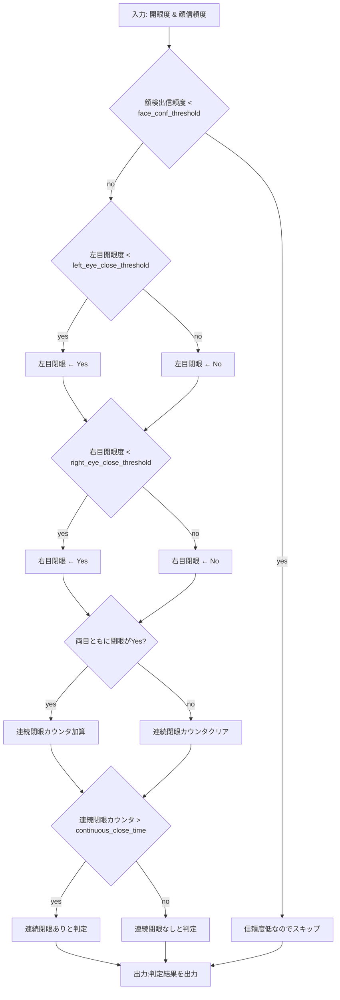

# 連続閉眼検知アルゴリズム仕様書 (AS_drowsy_detection)

## 1. 概要・目的

### 1.1 アルゴリズム名
- 連続閉眼検知アルゴリズム (Continuous Eye Closure Detection)
- 略称: AS_drowsy_detection
- バージョン: v1.0.4

### 1.2 目的・背景
- 左右の目の開眼度 (0.0 = 完全閉眼 ~ 1.0 = 完全開眼) を入力とし、指定時間以上連続して閉眼状態が続いた場合にアラートを発報する。


### 1.3 適用範囲
- 対象: カメラ映像・画像から抽出した開眼度情報と顔検出信頼度
- プラットフォーム: Python 実装を基準とし、C++ へ容易に移植できるようモジュール化
- ハードウェア: CPU ベース (組込み SoC 含む)。GPU 不要、60 fps 程度まで対応可能

---

## 2. 技術仕様

### 2.1 入力仕様
| フィールド | 型 | 説明 | 制約 |
| --- | --- | --- | --- |
| frame_num | int | フレーム番号 | 単調増加
| left_eye_open | float | 左目の開眼度 (0.0〜1.0) | 0.0 ≤ value ≤ 1.0
| right_eye_open | float | 右目の開眼度 (0.0〜1.0) | 0.0 ≤ value ≤ 1.0
| face_confidence | float | 顔検出信頼度 (0.0〜1.0) | 0.0 ≤ value ≤ 1.0

- 必須項目: 全フィールド必須
- 入力例:
```json
{
  "frame_num": 100,
  "left_eye_open": 0.15,
  "right_eye_open": 0.18,
  "face_confidence": 0.92
}
```

### 2.2 出力仕様
| フィールド | 型 | 説明 |
| --- | --- | --- |
| is_drowsy | int | 連続閉眼状態か否か。連続閉眼状態:1, 非連続閉眼状態:0, エラー:-1 |

- 出力例:
```json
{
  "is_drowsy": 1,
}
```

### 2.3 パラメータ
| パラメータ | 説明 | デフォルト値 | 下限 | 上限 |
| --- | --- | --- | --- | --- |
| left_eye_close_threshold | 左目の開眼度がこの値以下で閉眼と判定 | **0.30** | 0.0 | 1.0 |
| right_eye_close_threshold | 右目の開眼度がこの値以下で閉眼と判定 | **0.30** | 0.0 | 1.0 |
| continuous_close_time | 連続閉眼とみなす時間閾値 [s] | **1.00** | 0.1 | 10.0 |
| face_conf_threshold | 顔検出が有効とみなす信頼度 | **0.70** | 0.0 | 1.0 |

---

## 3. アルゴリズム詳細

### 3.1 アルゴリズムの概要
開眼度と顔検出信頼度を時系列で入力し、以下 3 モジュールで構成される。
1. **前処理モジュール**: 外れ値除去・正規化を行う。
2. **閉眼判定モジュール**: 左右それぞれの目について、`left_eye_close_threshold`、`right_eye_close_threshold` を用いて各フレームで閉眼フラグを生成。
3. **連続閉眼判定モジュール**: 左右両方の目が閉眼状態であるフラグが `continuous_close_time` 以上継続した場合に眠気フラグを立てる。

### 3.2 処理フロー



擬似コード:
```python
if face_confidence < face_conf_threshold:
    reset_timer()
    return is_drowsy=-1  # エラー

# 左右それぞれの目の閉眼判定
left_eye_closed = left_eye_open <= left_eye_close_threshold
right_eye_closed = right_eye_open <= right_eye_close_threshold

# 両目が閉眼状態かチェック
if left_eye_closed and right_eye_closed:
    update_timer(dt)
    if timer >= continuous_close_time:
        return is_drowsy=1   # 連続閉眼状態
    else:
        return is_drowsy=0   # 両目閉眼中だが時間不足
else:
    reset_timer()
    return is_drowsy=0       # 非連続閉眼状態
```

### 3.3 核心アルゴリズム
- 左右それぞれの目について独立した閉眼判定を行い、両方の目が閉眼状態である場合のみタイマーを加算する。
- 両目が閉眼状態でない場合はタイマーをリセットし、連続閉眼状態を解除する。
- 時間積分タイマーを利用した状態遷移モデル (有限状態機械)。
- 雑音の影響を減らすため指数移動平均 (EMA) を開眼度に適用可。

### 3.4 エラーハンドリング
- 顔信頼度が 0 の場合は計算をスキップし、ステータスを `unknown` とログに記録。
- 入力 NaN や範囲外値は直前の有効値で補完、もしくはリセット。

---


## 5. 実装仕様

### 5.1 開発環境
- 言語: Python 3.11
- 主要ライブラリ: numpy, opencv-python, pydantic (検証用)
- C++ 移植時は Eigen + OpenCV を使用予定

### 5.2 ファイル構成 (例)
```
source/
  ├── detectors/
  │     └── eye_state.py      # 開眼度推定器ラッパ
  ├── drowsy_detection.py     # 本アルゴリズム実装
  ├── config.py               # パラメータ定義
  ├── tests/
  │     └── test_drowsy.py    # 単体テスト
  └── cli.py                  # CLI エントリポイント
```

### 5.3 テスト仕様
- **単体テスト**: 閾値境界ケース、NaN 入力、顔未検出ケース
- **統合テスト**: 動画シミュレーションで 30 分連続再生し誤検知が 0 件であること
- **性能テスト**: Raspberry Pi 4 で 30 fps 処理時に CPU 使用率 &lt; 20 %

---

## 6. 使用例・サンプル

### 6.1 基本的な使用例
```python
from drowsy_detection import DrowsyDetector, Config

detector = DrowsyDetector(Config())
for frame in stream:
    result = detector.update(frame.open_left, frame.open_right, frame.face_score)
    if result.is_drowsy == 1:
        alert_driver()  # 連続閉眼状態
    elif result.is_drowsy == -1:
        handle_error()  # エラー状態
```


---


---

## 4. 参考資料
- "Real-Time Eye Closure Detection Using Convolutional Neural Networks", IEEE 2023
- OpenCV ドキュメント (v4.9)

---

## 5. 変更履歴
| 日付 | バージョン | 変更箇所 | 変更者 |
| --- | --- | --- | --- |
| 2025-08-05 | 1.0.0 | 初版作成 | GPT-Assist |
| 2025-08-05 | 1.0.1 | 入力仕様をframe_numに変更、出力仕様をint型に統一、セクション番号修正 | GPT-Assist |
| 2025-08-05 | 1.0.2 | 左右それぞれの目で独立した閉眼判定に変更、両目閉眼状態の継続時間で判定するロジックに修正 | GPT-Assist |
| 2025-08-06 | 1.0.3 | 処理フロー修正：タイマーが閾値を超えている間は連続閉眼フラグをONに保持するロジックに変更 | GPT-Assist |
| 2025-08-06 | 1.0.4 | 処理フロー大幅修正：フローチャートの表記修正、擬似コードとフローチャートの整合性確保 | GPT-Assist |
